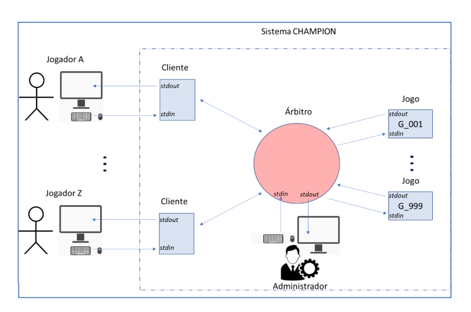

# CHAMPION

Sistema de gestão de campeonatos em linguagem C para a entrega do trabalho prático da cadeira de Sistemas Operativos, da Licenciatura de Engenharia Informática no Instituto Superior de Engenharia de Coimbra.

## Metas

### Metas 1 e 2
- *Entrega de um documento* com duas páginas descrevendo os pormenores da implementação e principais opções tomadas.

### Meta 3
- Entrega de um relatório. O relatório compreenderá o conteúdo que for relevante para justificar o trabalho feito, deverá ser da exclusiva autoria dos membros do grupo. Caso venha a ser divulgado entretanto um guia de elaboração do relatório, então este deverá seguir as indicações dadas

### Meta 1 - `Domingo, 8 de Novembro, 2020`
- [ ] Planear e definir as estruturas de dados responsáveis por gerir as definições de funcionamento no árbitro e no cliente. Definir os vários header files com constantes simbólicas que registem os valores por omissão comuns e específicos do cliente e servidor
bem como as estruturas de dados relevantes.
- [ ] Obter a “duração do campeonato” e o “tempo de espera”, aquando da execução do árbitro, através da leitura dos argumentos de linha de comandos. Sugestão: use as funções `getopt()` e `getsubopt()`.
- [x] Implementar um jogo respeitando as características referidas no enunciado, exceto o que se refere ao tratamento de sinais, que ainda não terá que existir. Bastará algo muito simples desde que siga a lógica dos jogos a usar com o sistema CHAMPION.
- [ ] Desenvolver a lógica de leitura das variáveis de ambiente GAMEDIR e MAXPLAYER pelo árbitro, refletindo-se nas estruturas de dados mencionadas no ponto anterior. Sugestão: use a função `getenv()`.
- [x] Desenvolver e entregar um makefile que possua os targets de compilação “all” (compilação de todos os programas), “cliente” (compilação do programa cliente), “árbitro” (compilação do programa servidor), “jogo” (compilação do programa jogo proposto) e “clean” (eliminação de todos os ficheiros temporários de apoio à compilação e dos executáveis).

### Meta 2 - `Domingo, 13 de Dezembro, 2020`
- [ ] Acrescentar ao jogo já implementado na meta 1 a parte do término aquando da receção do sinal SIGUSR1 e a disponibilização do resultado através do exit status.
- [ ] Implementar toda a lógica de comunicação entre os clientes e o árbitro através do mecanismo de named pipes.
- [ ] Implementar os comandos suportados pelo cliente: `#mygame` e `#quit`.
- [ ] Iniciar o desenvolvimento da leitura de comandos de administração do árbitro implementando a leitura e validação dos comandos e respetivos parâmetros, incluindo a implementação completa dos comandos `players`, `games`, `k` e `exit`.

### Meta 3 - `Domingo, 24 de Janeiro, 2021`
- [ ] Todos os requisitos expostos no enunciado.

## Resumo

O objetivo do sistema CHAMPION é mediar a comunicação entre as aplicações cliente usadas pelos
jogadores e os jogos propriamente ditos, gerindo o campeonato e mantendo uma tabela de pontuações.

## Conceitos
### Jogo
- Ficheiros executáveis iniciam por `g_` e localizam-se na diretoria indicada na variável de ambiente `GAMEDIR`.
- Pontuação do jogo comunicada pelo seu *exit status* e decidida por jogo.
- O output do jogo (por exemplo, a “pergunta desafio”) é efetuado pelo seu stdout
e o input (a resposta do jogador) é recebido no seu stdin.
- O jogo termina quando o campeonato terminar. Os jogos não têm objetivos.
- São baseados numa sequência de questões/respostas, em caso de erro mostra a resposta correta e prossegue para a questão seguinte.
- O jogo é de *carácter secundário*, a sua lógica não é importante. Alguns exemplos:
  - Adivinhar o número (gerado aleatóriamente).
  - Adivinhar tradução (palavra sorteada de uma lista built-in).
  - Calcular o resultado de uma expressão aritmética.

### Campeonato
- Conjunto de jogos jogados durante um determinano intervalo de tempo. O campeonato é aberto a `X` jogadores simultâneamente indicado pela variável de ambiente `MAXPLAYERS` e nunca superior a 30.
- O jogador só tem disponível um jogo durante o campeonato que será atribuído automáticamente pelo sistema.

### Cliente
- Programa usado pelo jogador para interagir com o árbitro do sistema (indiretamente com o jogo).
- Só recebe e envia ao árbitro o *input* do jogador. E recebe informação do árbitro oriunda do jogo.

### Árbitro
- Entidade que está entre o cliente e jogos.
- Gerido pelo administrador e não visível pelos jogadores, só interagível pelos clientes que subsequentemente interage com os jogos.

## Mais Info
Consultar o pdf para mais informações.